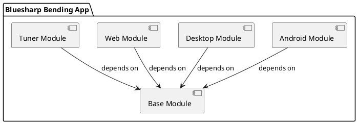
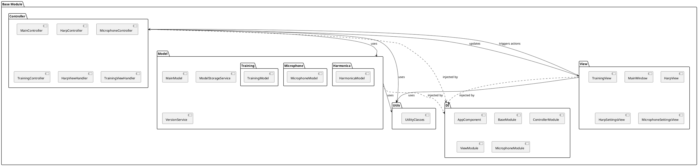
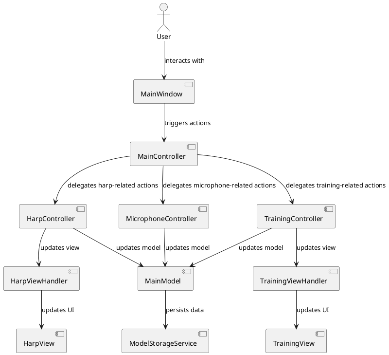
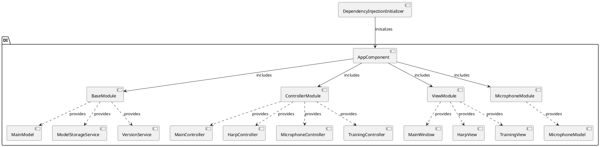

# Component Diagrams for Bluesharp Bending App

This document contains component diagrams for the Bluesharp Bending App, showing the high-level architecture and the relationships between components.

## High-Level Architecture

The Bluesharp Bending App is structured as a multi-platform application with a shared base module and platform-specific implementations for Android, Desktop, Web, and a separate Tuner module.



## Base Module

The Base Module contains the core functionality shared across all platforms, organized in an MVC (Model-View-Controller) architecture with dependency injection.



## Platform-Specific Modules

Each platform-specific module (Android, Desktop, Web) extends the base module with platform-specific implementations.

### Android Module

```plantuml
@startuml
package "Android Module" {
  package "App" {
    [MainActivity]
    [BlueSharpBendingApplication]
  }
  
  package "DI" {
    [AndroidAppComponent]
    [AndroidModule]
  }
  
  package "Model" {
    [AndroidSpecificModels]
  }
  
  package "View" {
    [AndroidViews]
    [Fragments]
    [Activities]
  }
  
  App --> DI : uses
  View --> DI : injected by
  Model --> DI : injected by
}

package "Base Module" as Base {
  [BaseComponents]
}

Android Module --> Base : extends
@enduml
```

### Desktop Module

```plantuml
@startuml
package "Desktop Module" {
  package "App" {
    [DesktopApplication]
    [DesktopLauncher]
  }
  
  package "DI" {
    [DesktopAppComponent]
    [DesktopModule]
  }
  
  package "Model" {
    [DesktopSpecificModels]
  }
  
  package "View" {
    [DesktopViews]
    [DesktopWindows]
  }
  
  App --> DI : uses
  View --> DI : injected by
  Model --> DI : injected by
}

package "Base Module" as Base {
  [BaseComponents]
}

Desktop Module --> Base : extends
@enduml
```

### Web Module

```plantuml
@startuml
package "Web Module" {
  package "Webapp" {
    [WebApplication]
    [WebComponents]
  }
}

package "Base Module" as Base {
  [BaseComponents]
}

Web Module --> Base : extends
@enduml
```

### Tuner Module

```plantuml
@startuml
package "Tuner Module" {
  package "Tuner" {
    [TunerApplication]
    [TunerComponents]
  }
}

package "Base Module" as Base {
  [BaseComponents]
}

Tuner Module --> Base : extends
@enduml
```

## Component Interactions

This diagram shows how the main components interact with each other during typical application usage.



## Dependency Injection Structure

This diagram shows how dependency injection is structured in the application.



These diagrams provide a comprehensive view of the application's architecture, showing the main components and their relationships. They can be used as a reference for understanding the codebase and for making architectural decisions in the future.